# FOC介绍

## 什么是 FOC？

**FOC（Field-Oriented Control）**，直译是磁场定向控制，也被称作**矢量控制**。

### 工作原理

无刷直流电机的三相绕组之间一般呈三角形连接或 Y 型连接。通过控制MOS管通断的组合，控制电机定子线圈电流的大小和方向，根据右手螺旋定则产生相应的磁场，通过同性相斥和异性相吸的原理吸引转子上的磁铁并引起转动。

通过精确控制MOS管的通断状态，可以实现电机转速和转向的精确控制。

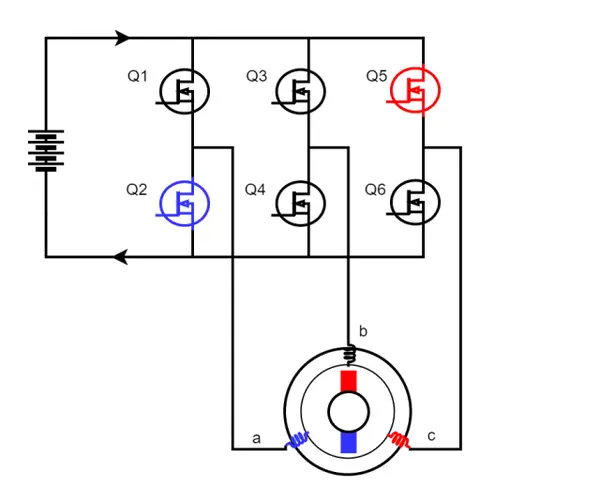

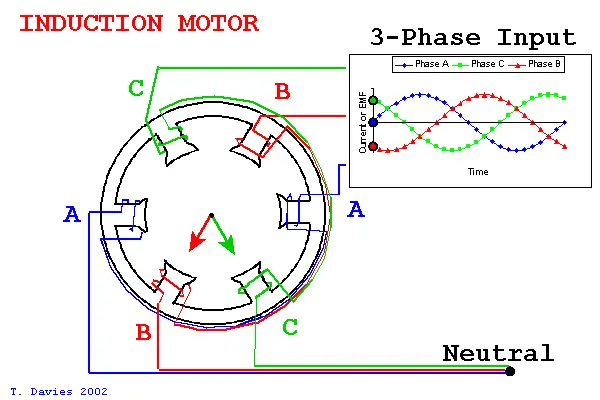

### 核心优势

- 电机运动转矩平稳
- 噪声小
- 效率高

---

## 控制流程（以PMSM和扭矩控制为例）

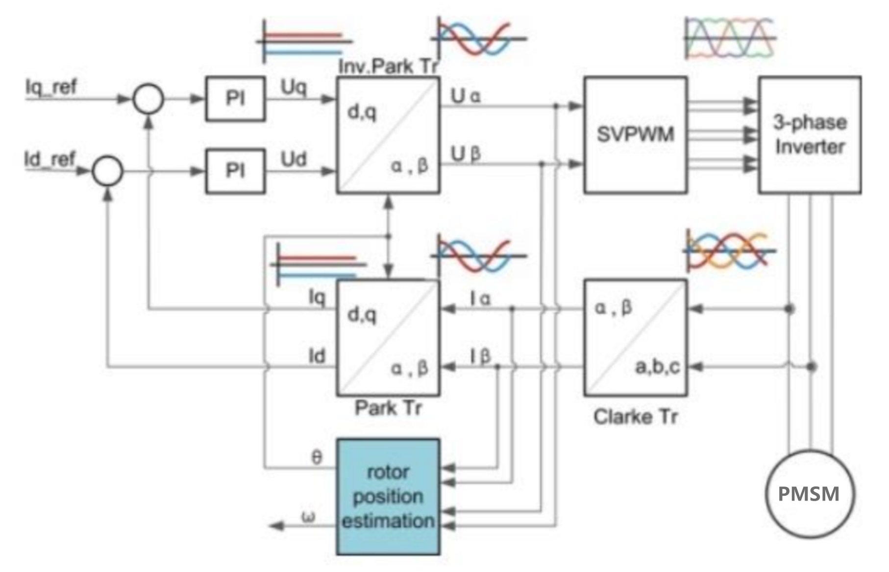

> 通过对电机的三相电流采集，转换计算出电机当前的转矩，再通过PID算法以及SVPWM对电机转矩进行精准控制。
> 

---

## FOC控制过程详解

### 1. 三相电流采样

对电机的三个相电流进行采样，一般对两个相采样就可以，可以根据**基尔霍夫电流定律**算出第三相的电流。

对于PMSM来说，这三个电流基本上就是三个相位相差120度的正弦波。

### 2. Clarke 克拉克转换

**目的：** 将三个正弦波 Ia、Ib、Ic 转化成正交直角坐标系的 Iα 和 Iβ，便于后续转换计算。

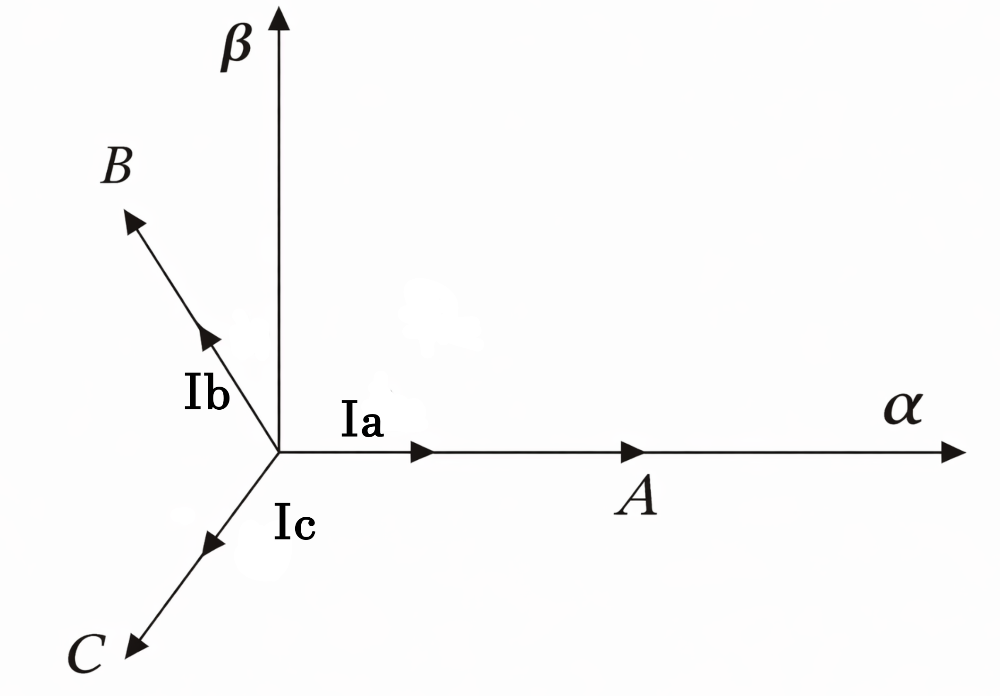

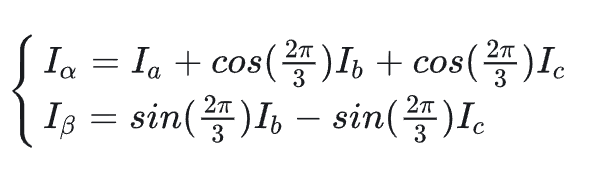

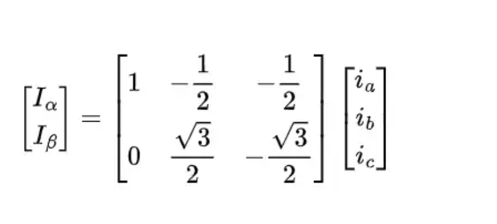

Clarke变换是将三相定子坐标系变换到正交直角坐标系中的过程：

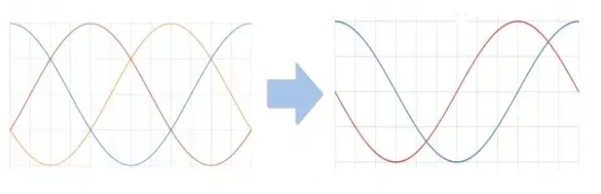

### 3. Park 帕克转换

**目的：** 将Clarke转换后的 Iα 和 Iβ 坐标系逆时针旋转当前转子的角度 θ，得到 Id 和 Iq。

- **Id** — 控制电机的磁通（垂直于电机半径）
- **Iq** — 控制电机的转矩（电机相切方向）

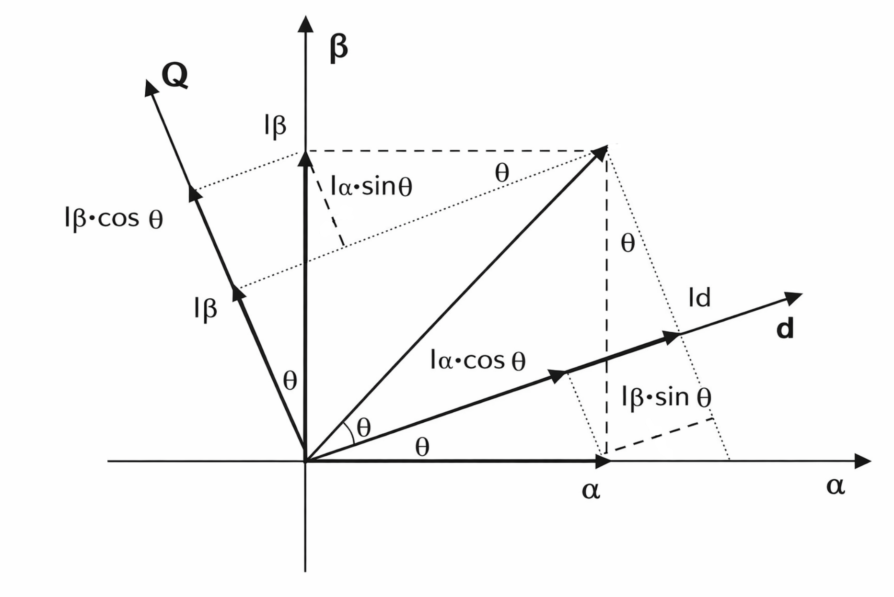

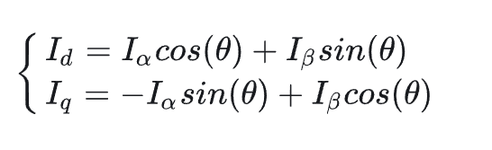

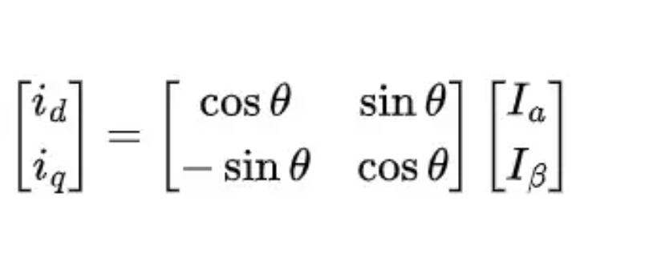

Park变换是将正交直角坐标系转换到转子侧的旋转坐标系：

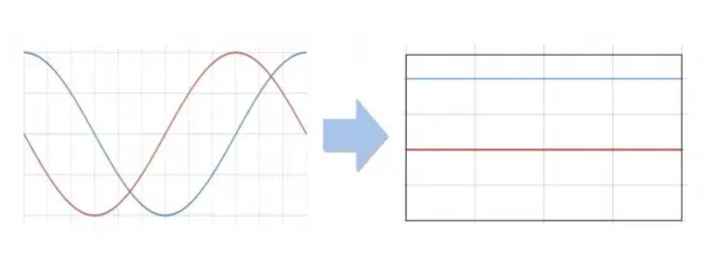

### 4. PID 控制

将 Id 和 Iq 与目标 Id_ref、Iq_ref 输入PID控制器（扭矩控制仅用PI）。

由于 Id 是我们不需要的，我们希望尽可能把它控制为 0（Id_ref = 0），进行PI运算得到需要输出的 Ud 和 Uq。

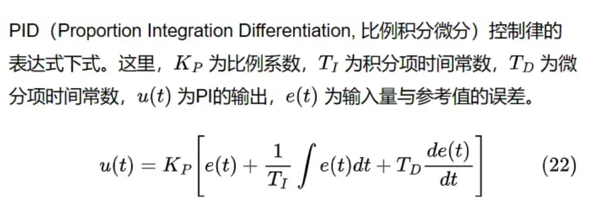

### 5. 反帕克运算

对输出的 Ud、Uq 进行反帕克运算，得到需要输出的 Uα、Uβ。

**关键机制：**

- 在 dq 坐标系里保持 Uq 常值（表示"永远沿转矩轴推"）
- 用反帕克把它实时转回 αβ 坐标系
- 于是 αβ 里的电压矢量会随着 θ 转动
- 最终三相电压就是随角度变化的正弦（或 SVPWM 等效）——这才会得到稳定转矩

> 这就是 FOC "像直流电机一样控制转矩"的关键。
> 

### 6. SVPWM 输出

通过SVPWM算出该时刻三个半桥的状态编码值和定时器的重装载值，控制三相逆变器的MOS管开关，驱动电机。

---

## 速度环和位置环

### 速度环

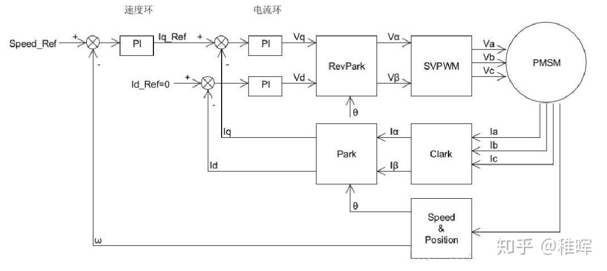

在上图中：

- **Speed_Ref** 是速度设定值
- **ω** 是电机的转速反馈，可以通过电机编码器或者霍尔传感器等计算得到

依然使用 **PI控制**。将计算得到的电机速度 ω 与速度设定值 Speed_Ref 进行误差值计算，代入速度PI环，计算的结果作为电流环的输入，就实现了**速度-电流的双闭环控制**。

### 位置环

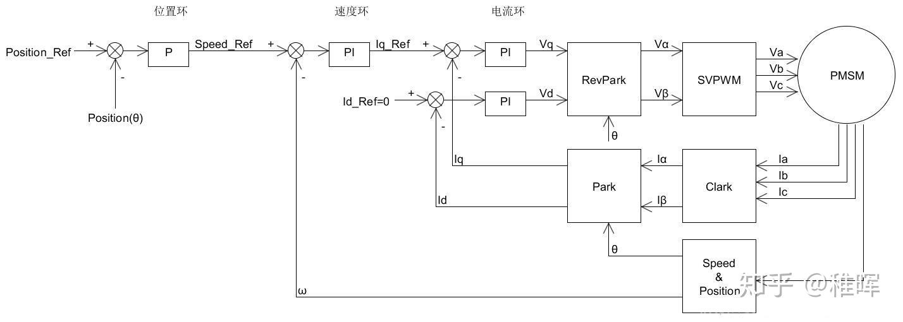

#### 低速时的挑战

在实际使用中，由于编码器无法直接返回电机转速 ω，因此可以通过计算一定时间内的编码值变化量来表示电机的转速（也即用**平均速度**代表**瞬时速度**）。

- **高速时：** 这样的方式是可行的
- **低速时：** 电机转速很慢，用平均测速法会存在非常大的误差（转子不动或者动得很慢，编码器就没有输出或者只输出1、2个脉冲）

#### 位置-电流双环控制

为了避免速度环节带来的误差，在做位置控制的时候可以只使用位置和电流组成的双环进行控制。

此时需要对位置环做一定的变化，控制框图如下：

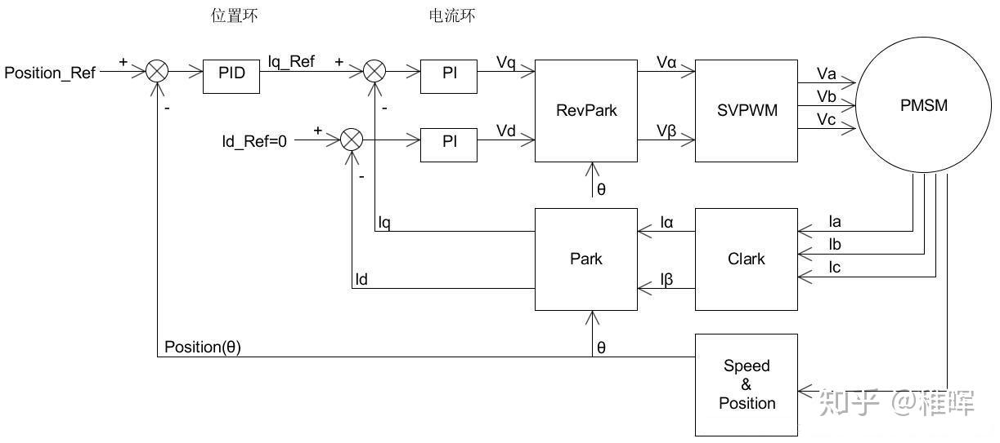

由于去掉了速度环，这里的位置环我们使用完整的 **PID控制**，即把微分项加上：

- **微分项：** 因为位置的微分就是速度，这样可以减小位置控制的震荡，加快收敛
- **积分项：** 消除静态误差

---

*参考来源：知乎 @稚晖*