# SVPWM原理计算

## 基本概念

### 八种开关状态

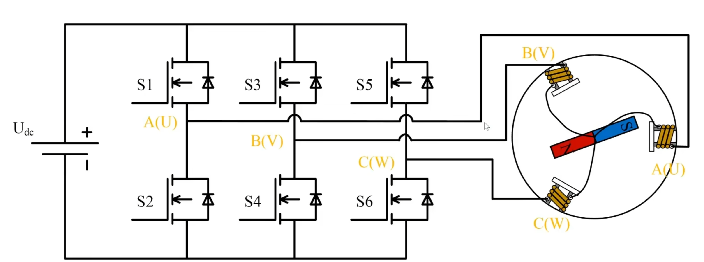

把上管导通（连接电源正极输出高电平）视为 **1**，下管导通（连接电源负极输出高电平）视为 **0**，可以得到下表共八种状态：

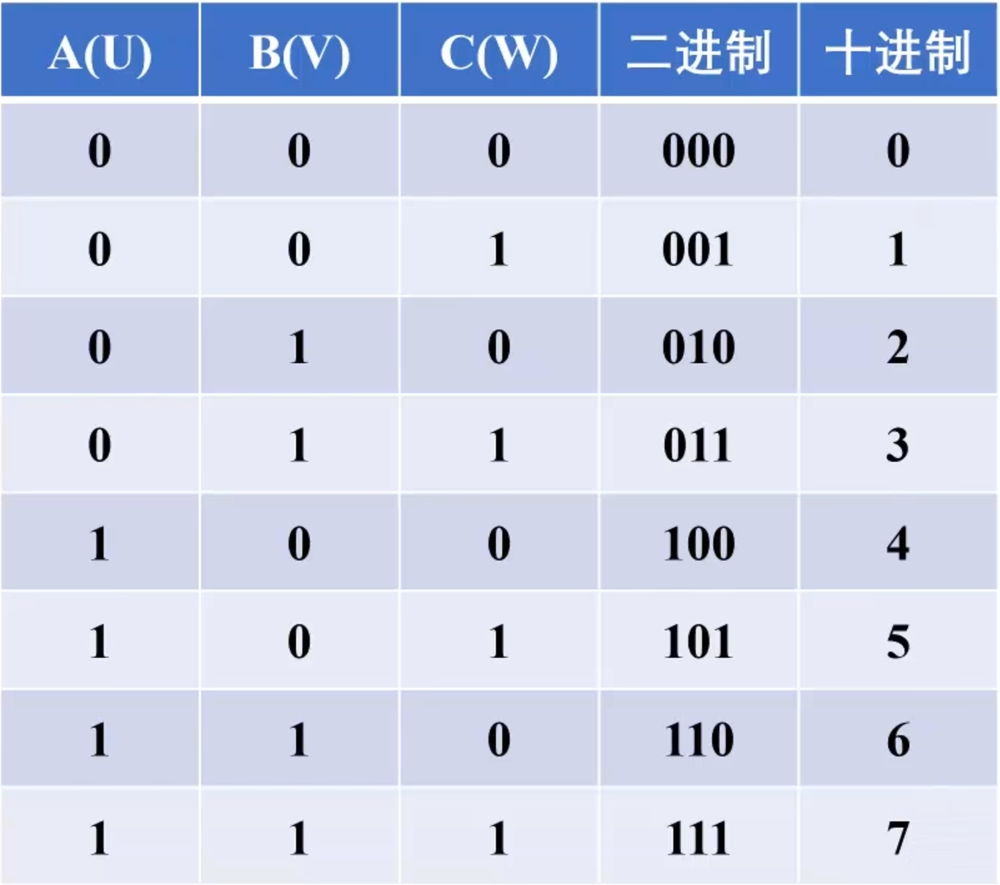

### 转子受力分析

做八种状态转子的受力分析图，**以100为例**：

- S1、S4、S6闭合
- 电流从正极流经S1通过A，再流到S4/S6回到负极
- 线圈A吸引转子，线圈B/C排斥转子，形成U4方向的力

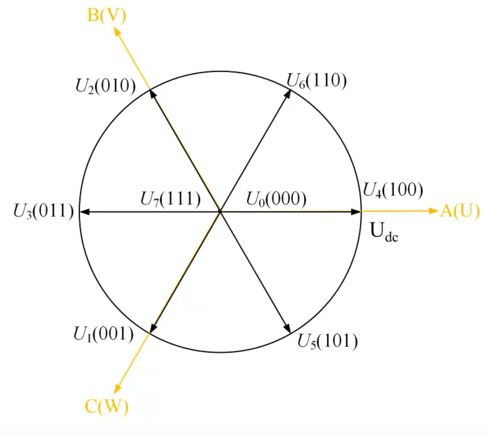

---

## 控制力矩计算

将一定时间内都做上述100状态输出的力作为1。一般我们做FOC控制时，为了保证对各个方向的控制效果/力矩平均，一般最大到 **√3/2**。

### 为什么是 √3/2？

在各个方向中，最短的方向是两个线圈正中间的方向，如U4和U6正中间的方向，需要用1/2的时间输出100，1/2的时间输出110合成。通过100和110的向量合成，长度为 **√3/2 Udc**。

**计算过程：**

1/2U4(100) 和 √3/2 Udc 和平移后的1/2U6(100) 可以看作一个120°的等腰三角形。

可以拆分成两个斜边是1/2Udc的 60°直角三角形拼在一起。

根据 sin60° = √3/2，得到：2 × (1/2 × √3/2) = √3/2

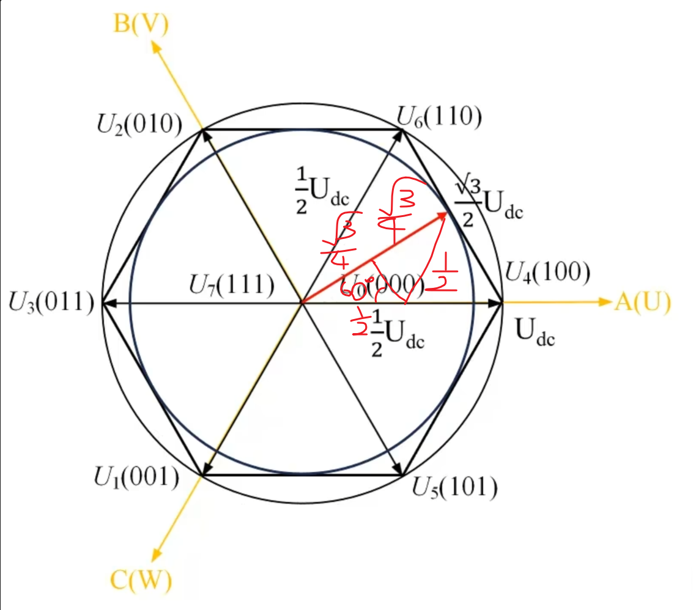

中间点往U6或U4的方向逐步递增到达Udc，为了控制效果/力矩平均，故都使用 **√3/2 Udc** 进行控制。

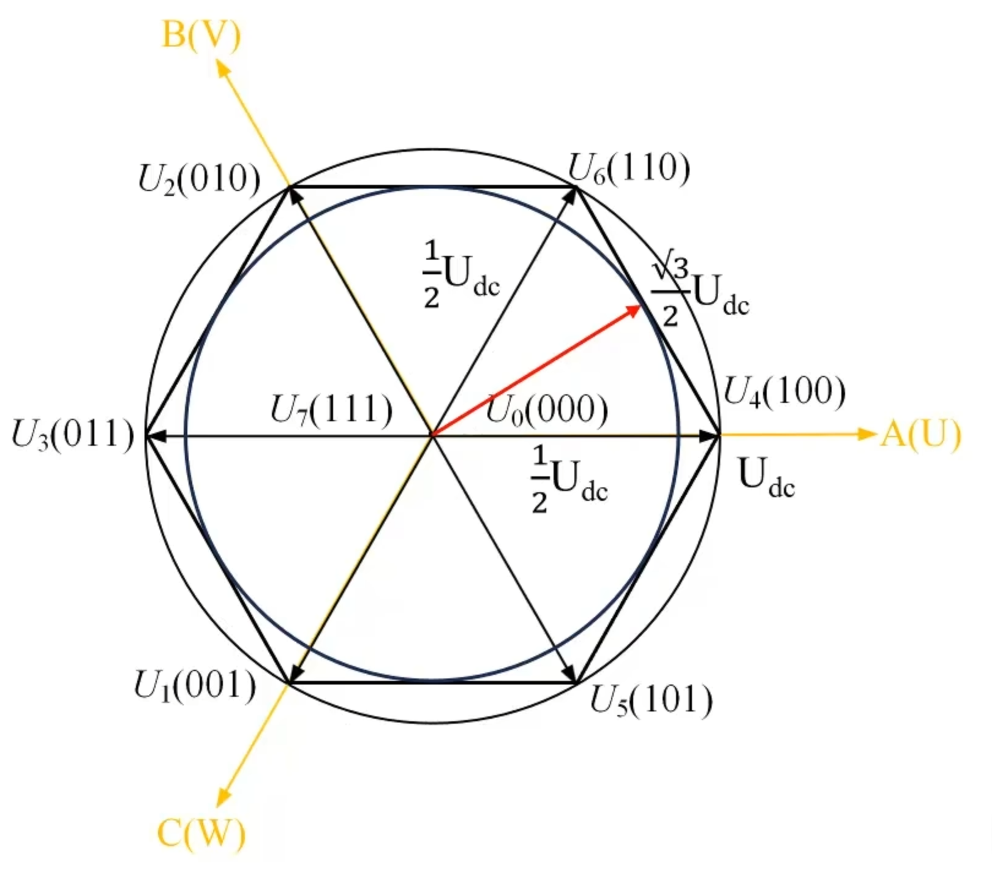

> 当目标向量 Uq < √3/2Udc 时，可以用相邻两个轴的向量 + U0 和 U7 来组成。
> 

---

## 磁场原理

**磁铁磁场方向：**

- 外部：N指向S
- 内部：S指向N

磁铁最终内外部会指向同一个方向。通过受力分析可知：**当外磁场和内磁场夹角为90°时，效率最大，扭矩也最大。**

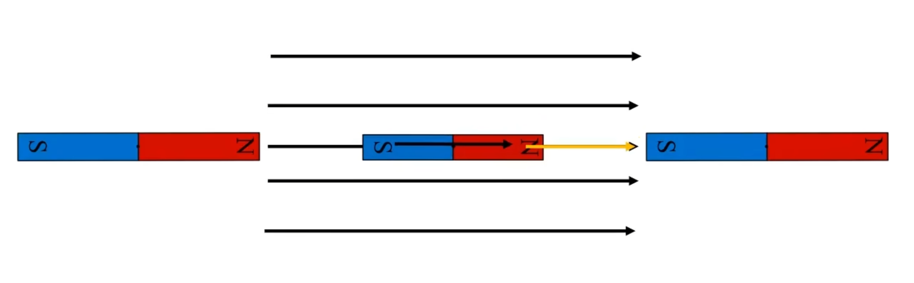

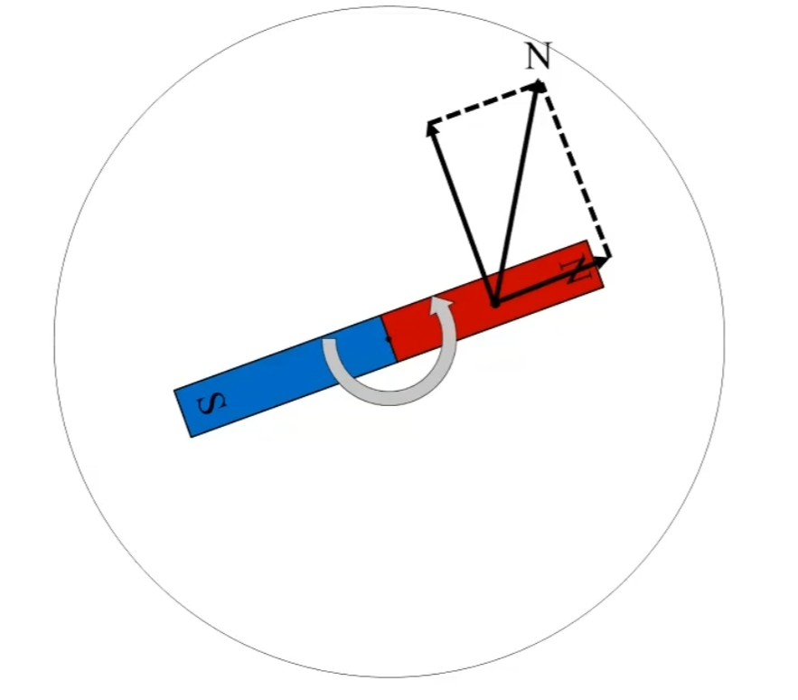

---

## T4、T6 时间计算

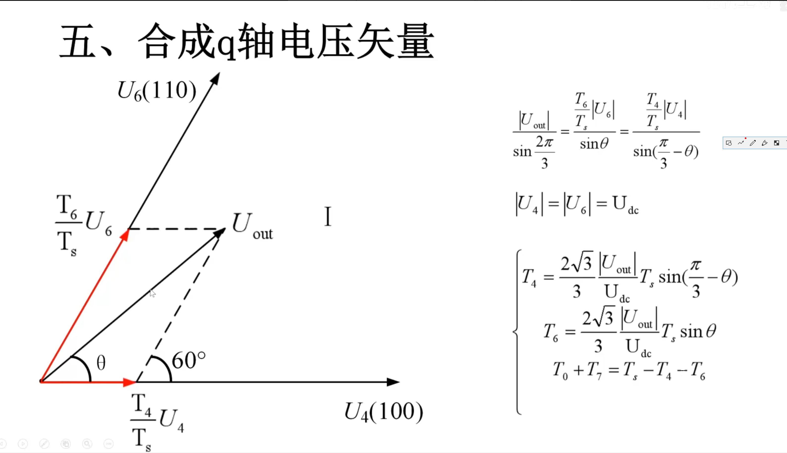

### 计算过程

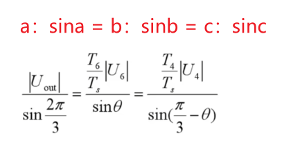

已知：sin(2π/3) = sin120° = sin60° = √3/2

分别通过T4和T6与 |Uout|/sin(2π/3) 进行移项可以得到相应公式。

**总时间** = T4 + T6 + T0 + T7

---

## 不同扇区计算

不在扇区1时，可以通过 **当前角度 - 扇区数×60°** 转换为第一扇区再计算，最后把U的值带入到对应扇区的两轴就可以了。

### PWM预设值计算

根据T的时间可以算出 PWM的预设值。

**时间转换成比较值1、2、3：** 通过1、2、3的时间除以总时间×总计数值

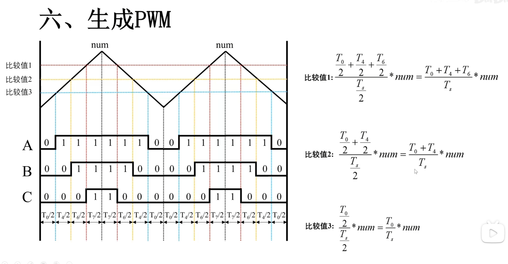

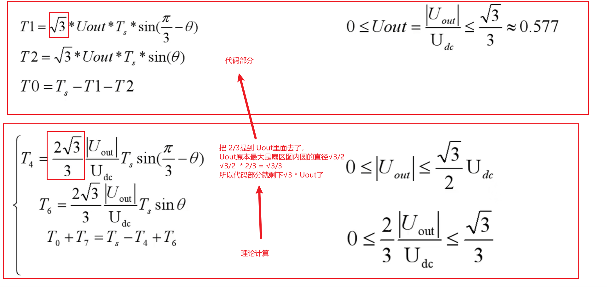

### PWM重装载值计算

通过T的时间计算出PWM的重装载值：

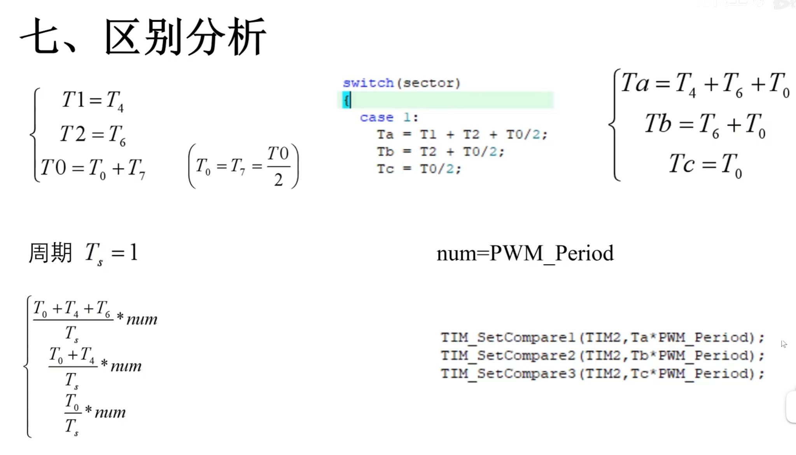

---

## 控制方式对比

### 闭环控制

根据当前电机方向，实时控制磁场方向进行控制，通过PID调节最终到达设定角度。

### 开环控制

直接将磁场设置为目标角度的磁场，给固定的电压矢量长度和电压矢量角度，让电机直接转到设定角度。

**优点：** 控制方便

**缺点：** 电流会一直很大，容易烧驱动，需要设限

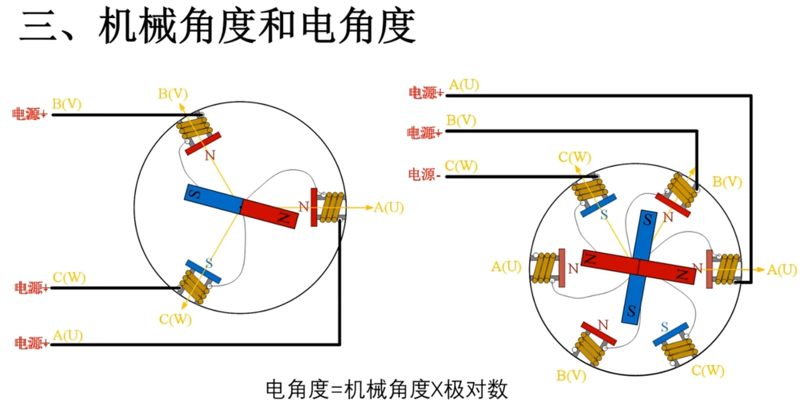