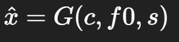

### 前言

这篇博客正文包括两部分：
1. 原理：RVC实现原理，到底靠什么变声（训练、检索）
2. 我在 Windows 上把流程跑稳的做法：配置、参数区间、踩坑及排查

方大同版《岁月里的花》：
[岁月里的花.fangdatong.clean.boost.cover.mp3](岁月里的花.fangdatong.clean.boost.cover.mp3)

> 版权/授权：素材与作品仅做学习交流，使用请自己确认授权边界（人声数据、歌曲、伴奏、发布平台规则）。
> 

---

# 原理

## 1）RVC 要解决什么问题

RVC（Retrieval-based Voice Conversion）属于语音转换（VC）：

- **输入**：一段语音/歌声（包含“内容 + 情绪/语调 + 音高”）
- **输出**：内容基本保持，但**音色/说话人身份**变成目标人

核心思想是把三件事拆开处理：

- **说了什么**：由“内容表征（content embedding）”承载
- **怎么唱/怎么抑扬顿挫**：由 F0（音高轨迹）承载
- **像谁**：由说话人条件（speaker condition）承载
- **检索**：在特征空间找目标人数据的“参考”，帮助补细节、稳输出

---

## 2）三类核心信号：c、f0、s

### 2.1 内容特征 c（Content Embedding）

- 来源：预训练语音表征模型（HuBERT / ContentVec / Wav2Vec2 类）
- 目标：尽量表达“内容/音素信息”，减少音色泄漏
- 形态：帧级序列 `c_t ∈ R^d`

### 2.2 音高 f0（Pitch）

- 来源：音高提取器（RMVPE / CREPE / Harvest 等）
- 目标：保留旋律（唱歌）或语调（说话）
- 形态：帧级序列 `f0_t`（常配合清浊音/uv）
- 作用：告诉模型“要合成成谁的音色”

### 2.3 说话人条件 s（Speaker Condition）

- 单说话人模型：`s` 通常是固定常量（或固定 embedding）
- 多说话人模型：`s` 是 speaker id 或 speaker embedding（可切换音色）

---

## 3）整体架构：生成（主）+ 检索增强（辅）

### 3.1 生成器 G（核心，真正“出声”）

生成器把条件输入合成为连续自然语音：

- `c`：融合后的内容特征（可能包含检索增强）
- `f0`：输入音高
- `s`：目标说话人条件
- 输出：最终波形 `\hat{x}`（或等价声学表征再转波形）

> 核心点：**最终声音的连续性、自然度、音色细节，主要由 G 决定。**
> 

### 3.2 检索库 index（辅助，用来“补条件”）

- index 存储的是：目标人训练集提取的**内容特征向量**（帧级）
- 推理时：对输入内容特征逐帧做近邻检索，取到参考特征并融合，得到 `\tilde{c}`

---

## 4）推理流程（Inference）：从输入到输出

给定输入音频 `x_in`：

1. 提内容特征：`c = Encoder(x_in)`
2. 提音高：`f0 = Pitch(x_in)`
3. （可选）检索增强：用 `c_t` 查询 index 得到 `r_t`，融合为 `\tilde{c}_t`
4. 生成器合成：`x_out = G(\tilde{c}, f0, s)`
5. （可选）后处理：响度匹配、轻微 EQ、去爆破/去齿音等

---

## 5）训练流程（Training，重点）：训练到底训练了什么？

你可以把训练理解成：**学一个“条件合成器” G**，让它掌握目标人的发声分布。

### 5.1 训练的基本闭环

对目标人训练集每条真实音频 `x`：

1. 计算监督条件（通常 Encoder 冻结、Pitch 独立）
- `c = Encoder(x)`
- `f0 = Pitch(x)`
1. 生成器重建
- `x_hat = G(c, f0, s)`
1. 用损失逼近真实 `x`，更新模型参数（主要更新 G，可能还有判别器 D）

> 训练完成后，G 学会的是：在给定“内容+音高+身份”的条件下，如何生成**连续自然、像目标人**的波形。
> 

### 5.2 训练学到的“音色”是什么

更具体地说，G 会学到：
- 共振峰结构及其随音素变化的规律（音色核心）
- 谐波包络、气声比例、声门特性（质感/呼吸感）
- 辅音/擦音/爆破音的高频细节生成方式（清晰度关键）
- 连续时序的平滑（避免碎片、跳变、破音）

### 5.3 常见损失项的“作用感”

不同实现略有差异，但思路类似：
- 重建类损失（mel / STFT / waveform）：保证内容不跑、可懂度、基础音质
- 对抗损失（GAN，判别器 D）：提升真实感、清晰度，减少“合成味”
- 特征匹配/多尺度约束：稳定训练，减少金属音、电流音、抖动/破音

可以粗略记成：**重建负责“对”，对抗负责“像真”。**

---

# 实践

## 1）环境搭建：

全程使用codex对Retrieval-based-Voice-Conversion-WebUI 进行环境搭建

## 2）训练音源准备：

对方大同热门的单曲进行下载，筛选掉live、合唱等曲目确保数据质量，通过`HP5_only_main_vocal`模型进行人声提取，并通过`VR-DeEchoAggressive` 和 `VR-DeEchoDeReverb` 模型进行混响和回音的去除得到干净的人声训练数据。

## 3）我的训练配置

这次我用的是（关键项）：

- 采样率：`40k`
- 版本：`v2`
- F0：`if_f0 = 1`
- `batch_size = 4`
- `total_epoch = 20`
- 预训练：`f0G40k.pth` + `f0D40k.pth` （须选用预训练）

---

## 4）推理参数：

我这套“能稳定出结果”的配置（核心项）：

- 分离：`HP5_only_main_vocal`
- 后处理：`VR-DeEchoAggressive` + `VR-DeEchoDeReverb`
- F0：`rmvpe`
- `index_rate = 0.5`
- `protect = 0.3`
- `rms_mix = 0.25`
- `filter_radius = 3`
- 混音：人声 `1.25~1.2589`，伴奏 `0.9`

### 这几个参数我怎么用（不靠玄学）

- `index_rate`：越大越“借目标人库”，通常更像更清晰；太大容易碎片/带噪
- `protect`：越大越“保护原声”，换声就会变弱（原唱指纹更容易残留）
- `rms_mix`：越低越“模型主导”，越高越贴近输入响度走向
- `filter_radius`：能抹掉部分毛刺，但别指望它解决本质问题

常用区间：
- 稳妥：`index_rate 0.35~0.5`，`protect 0.3~0.35`
- 激进：`index_rate 0.75~0.95`，`protect 0.15~0.25`
- `rms_mix`：`0.25~0.6`

---

## 5）重点踩坑：

推理出来的成品人声部分异常，部分无声音，部分声音鬼畜、断层。

排查：
1）对输入到推理过程的音频进行输出，逐个听发现RVC生成的纯人声就是异常的。

2）对推理参数进行检查未发现异常

3）对训练参数进行检查，发现未成功加载预训练模型

4）修复加载错误后重新训练模型，成功输出成品

---

## 6）回到结果：方大同模型为什么能比较像地唱出来

我现在的体感是：像不像不是靠“一个神参数”。更像是三件事乘起来：

- 数据干净且覆盖足够（尤其元音、气声、尾音、连读）
- 训练确实加载了预训练权重，训练过程稳定
- 推理链路固定、能复盘（参数有记录、能回滚）

想继续提升相似度：优先优化数据（质量/覆盖），再增加训练轮次；最后才是激进推理参数。

---

## 7）待提升点

### 1、部分处理仍不够自然，高音部分也仍有较重的原歌手痕迹。

提高方向：增加、优化训练数据，能有效优化效果。

### 2、当前修改只是针对歌曲的演唱音色进行了替换，唱法、律动还是原唱歌手的，无法使作品呈现方大同的R&B风格，下面两个音频较明显

eason模型（训练素材未精细筛选）演唱《岁月里的花》 ： [岁月里的花.eason.clean.boost.cover.mp3](岁月里的花.eason.clean.boost.cover.mp3)

fangdatong模型演唱《无底洞》 ：[无底洞.fangdatong.clean.boost.cover.mp3](无底洞.fangdatong.clean.boost.cover.mp3)

提高方向：可用**so-vits-svc等技术路线进行训练，看是否可以进行演唱风格迁移**

Suno v5尝试可以较成熟地进行风格转换